---
## Front matter
title: "Отчёт по лабораторной работе №2"
subtitle: "Дисциплина: Архитектура компьютера"
author: "Абакумов Тимофей Александрович"

## Generic otions
lang: ru-RU
toc-title: "Содержание"

## Bibliography
bibliography: bib/cite.bib
csl: pandoc/csl/gost-r-7-0-5-2008-numeric.csl

## Pdf output format
toc: true # Table of contents
toc-depth: 2
lof: true # List of figures
lot: true # List of tables
fontsize: 12pt
linestretch: 1.5
papersize: a4
documentclass: scrreprt
## I18n polyglossia
polyglossia-lang:
  name: russian
  options:
	- spelling=modern
	- babelshorthands=true
polyglossia-otherlangs:
  name: english
## I18n babel
babel-lang: russian
babel-otherlangs: english
## Fonts
mainfont: IBM Plex Serif
romanfont: IBM Plex Serif
sansfont: IBM Plex Sans
monofont: IBM Plex Mono
mathfont: STIX Two Mathreplacing image with description
mainfontoptions: Ligatures=Common,Ligatures=TeX,Scale=0.94
romanfontoptions: Ligatures=Common,Ligatures=TeX,Scale=0.94
sansfontoptions: Ligatures=Common,Ligatures=TeX,Scale=MatchLowercase,Scale=0.94
monofontoptions: Scale=MatchLowercase,Scale=0.94,FakeStretch=0.9
mathfontoptions:
## Biblatex
biblatex: true
biblio-style: "gost-numeric"
biblatexoptions:
  - parentracker=true
  - backend=biber
  - hyperref=autoreplacing image with description
  - language=auto
  - autolang=other*
  - citestyle=gost-numeric
## Pandoc-crossref LaTeX customization
figureTitle: "Рис."
tableTitle: "Таблица"
listingTitle: "Листинг"
lofTitle: "Список иллюстраций"
lotTitle: "Список таблиц"
lolTitle: "Листинги"
## Misc options
indent: true
header-includes:
  - \usepackage{indentfirst}
  - \usepackage{float} # keep figures where there are in the text
  - \floatplacement{figure}{H} # keep figures where there are in the text
---

# Цель работы

Целью работы является изучить идеологию и применение средств контроля версий. Приобрести практические навыки по работе с системой git.

# Задание

**Порядок выполнения лабораторной работы**
1. Настройка github.
Существует несколько доступных серверов репозиториев с возможностью бесплатного
размещения данных. Например, http://bitbucket.org/, https://github.com/ и https://gitflic.ru.
Для выполнения лабораторных работ предлагается использовать Github.
Создайте учётную запись на сайте https://github.com/ и заполните основные данные.
2. Базовая настройка git.
Сначала сделаем предварительную конфигурацию git. Откройте терминал и введите
следующие команды, указав имя и email владельца репозитория:
git config --global user.name "<Name Surname>"
git config --global user.email "<work@mail>"
Настроим utf-8 в выводе сообщений git:
git config --global core.quotepath false
Зададим имя начальной ветки (будем называть её master):
git config --global init.defaultBranch master
Параметр autocrlf:
git config --global core.autocrlf input
Параметр safecrlf:
git config --global core.safecrlf warn
3. Создание SSH ключа.
Для последующей идентификации пользователя на сервере репозиториев необходимо
сгенерировать пару ключей (приватный и открытый):
ssh-keygen -C "Имя Фамилия <work@mail>"
Ключи сохраняться в каталоге ~/.ssh/.
Далее необходимо загрузить сгенерённый открытый ключ. Для этого зайти на сайт http:
//github.org/ под своей учётной записью и перейти в меню Setting . После этого выбрать
в боковом меню SSH and GPG keys и нажать кнопку New SSH key . Скопировав из локальной
консоли ключ в буфер обмена
cat ~/.ssh/id_rsa.pub | xclip -sel clip
вставляем ключ в появившееся на сайте поле и указываем для ключа имя (Title)
4. Сознание рабочего пространства и репозитория курса на основе шаблона.
При выполнении лабораторных работ следует придерживаться структуры рабочего пространства. Рабочее пространство по предмету располагается в следующей иерархии:
~/work/study/
└── <учебный год>/
└── <название предмета>/
└── <код предмета>/
Например, для 2024–2025 учебного года и предмета «Архитектура компьютера» (код предмета arch-pc) структура каталогов примет следующий вид:
~/work/study/
└── 2023–2024/
└── Архитектура компьютера/
└── arch-pc/
└── labs/
└── lab01/
└── lab02/
└── lab03/
...
• Каталог для лабораторных работ имеет вид labs.
• Каталоги для лабораторных работ имеют вид lab<номер>, например: lab01, lab02 и
т.д.
Название проекта на хостинге git имеет вид: study_<учебный год>_<код предмета>
Например, для 2024–2025 учебного года и предмета «Архитектура компьютера» (код предмета arch-pc) название проекта примет следующий вид: study_2024-2025_arch-pc
Откройте терминал и создайте каталог для предмета «Архитектура компьютера»:
mkdir -p ~/work/study/2024-2025/"Архитектура компьютера"
5. Сознание репозитория курса на основе шаблона.
Репозиторий на основе шаблона можно создать через web-интерфейс github.
Перейдите на станицу репозитория с шаблоном курса https://github.com/yamadharma/cour
se-directory-student-template.
Далее выберите Use this template.
В открывшемся окне задайте имя репозитория replacing image with description(Repository name) study_2024–2025_arhpc и создайте репозиторий (кнопка Create repository from template).
Откройте терминал и перейдите в каталог курса:
cd ~/work/study/2024–2025/"Архитектура компьютера"
клонируйте созданный репозиторий:
git clone --recursive git@github.com:<user_name>/study_2024–2025_arh-pc.git
↪ arch-pc
Ссылку для клонирования можно скопировать на странице созданного репозитория Code
-> SSH:
6. Настройка каталога курса.
Перейдите в каталог курса:
cd ~/work/study/2024-2025/"Архитектура компьютера"/arch-pc
Удалите лишние файлы:
rm package.json
Создайте необходимые каталоги:
echo arch-pc > COURSE
make
Отправьте файлы на сервер:
git add .
git commit -am 'feat(main): make course structure'
git push
Проверьте правильность создания иерархии рабочего пространства в локальном репозитории и на странице github.

**Задание для самостоятельной работы**
1. Создайте отчет по выполнению лабораторной работы в соответствующем каталоге
рабочего пространства (labs>lab02>report).
2. Скопируйте отчеты по выполнению предыдущих лабораторных работ в соответствующие каталоги созданного рабочего пространства.
3. Загрузите файлы на github.

# Выполнение лабораторной работы

Создадим учётную запись на сайте https://github.com/ и заполним основные данные(рис. [-@fig:001])

{#fig:001 width=70%}

Откроем созданный профиль на Github(рис. [-@fig:002])

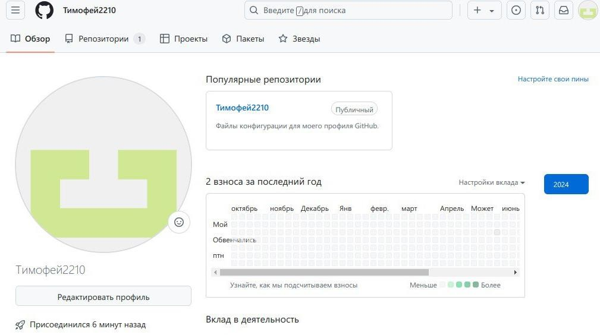{#fig:002 width=70%}

Сначала сделаем предварительную конфигурацию git. Откроем терминал и введём
следующие команды, указав имя и email владельца репозитория(рис. [-@fig:003])

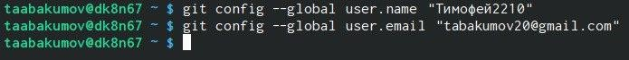{#fig:003 width=70%}

Настроим utf-8 в выводе сообщений git. Зададим имя начальной ветки (будем называть её master), параметр autocrlf и параметр safecrlf(рис. [-@fig:004])

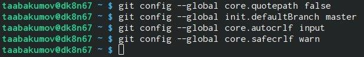{#fig:004 width=70%}

Для последующей идентификации пользователя на сервере репозиториев сгенерируем пару ключей (приватный и открытый)(рис. [-@fig:005])

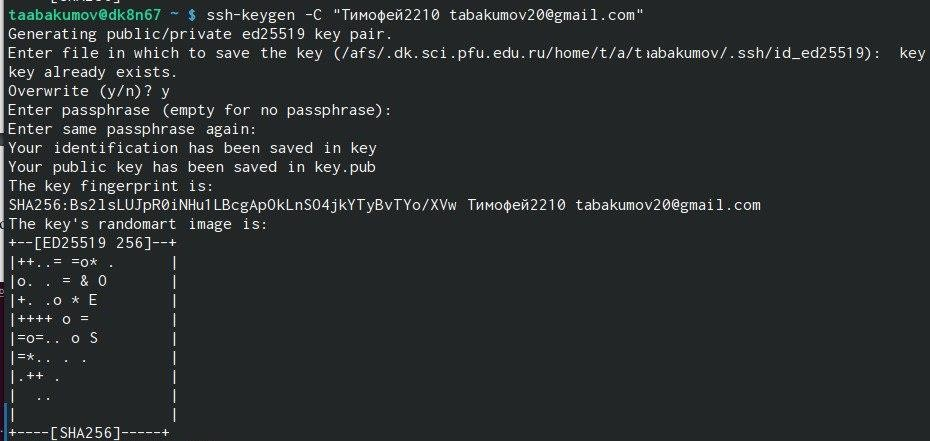{#fig:005 width=70%}

Ключи сохранились в каталоге ~/.ssh/.
Далее загрузим сгенерённый открытый ключ. Для этого зайдём на сайт http: //github.org/ под своей учётной записью и перейдём в меню *Setting*.
После этого выберем в боковом меню *SSH and GPG keys* и нажмём кнопку *New SSH key* . Скопировав из локальной консоли ключ в буфер обмена вставляем ключ в появившеreplacing image with descriptionеся на сайте поле и указываем для ключа имя (Title)(рис. [-@fig:006])

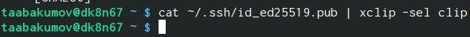{#fig:006 width=70%}

Далее, откроем терминал и создадим каталог для предмета «Архитектура компьютера»(рис. [-@fig:007])

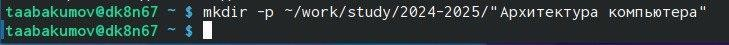{#fig:007 width=70%}

Репозиторий на основе шаблона можно создать черезreplacing image with description web-интерфейс github. Перейдём на
станицу репозитория с шаблоном курса https://github.com/yamadharma/cour se-directorystudent-template. Далее выберем *Use this template*. В открывшемся окне зададим имя репозитория (Repository name) study_2024–2025_arh-pc и создадим репозиторий (кнопка *Create repository from template*). Откроем терминал и перейдём в каталог курса(рис. [-@fig:008])

{#fig:008 width=70%}

Далее клонируем созданный репозиторий, ссылку для клонирования скопируем на странице
созданного репозитория Code SSH(рис. [-@fig:009])

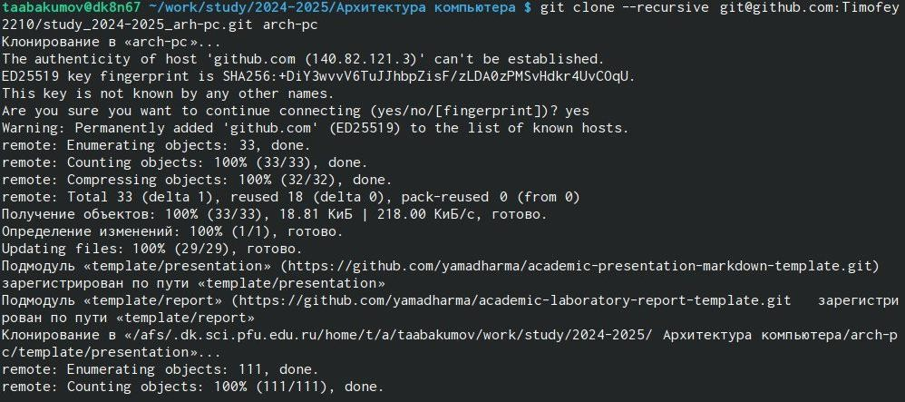{#fig:009 width=70%}

После клонирования репозитория настроем каталог курса. Для начала перейдём в него и
удалим лишние файлы. После этого создадим необходимые каталоги(рис. [-@fig:010])

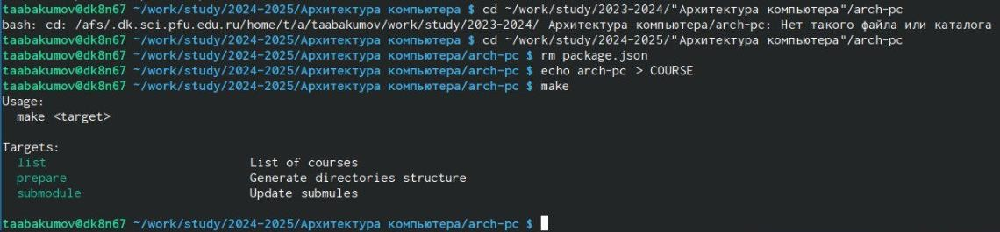{#fig:010 width=70%}

Далее отправим файлы на сервер и проверим правильность создания иерархии рабочего
пространства в локальном репозитории и на странице github(рис. [-@fig:011])

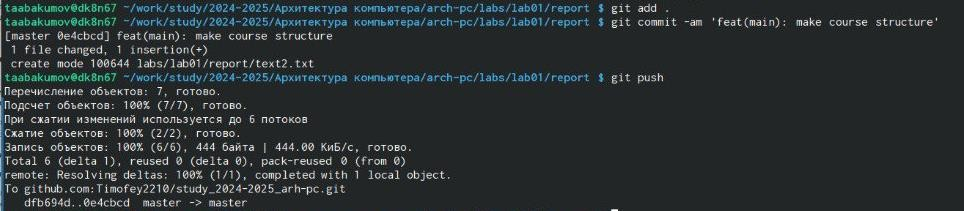{#fig:011 width=70%}

(рис. [-@fig:012])

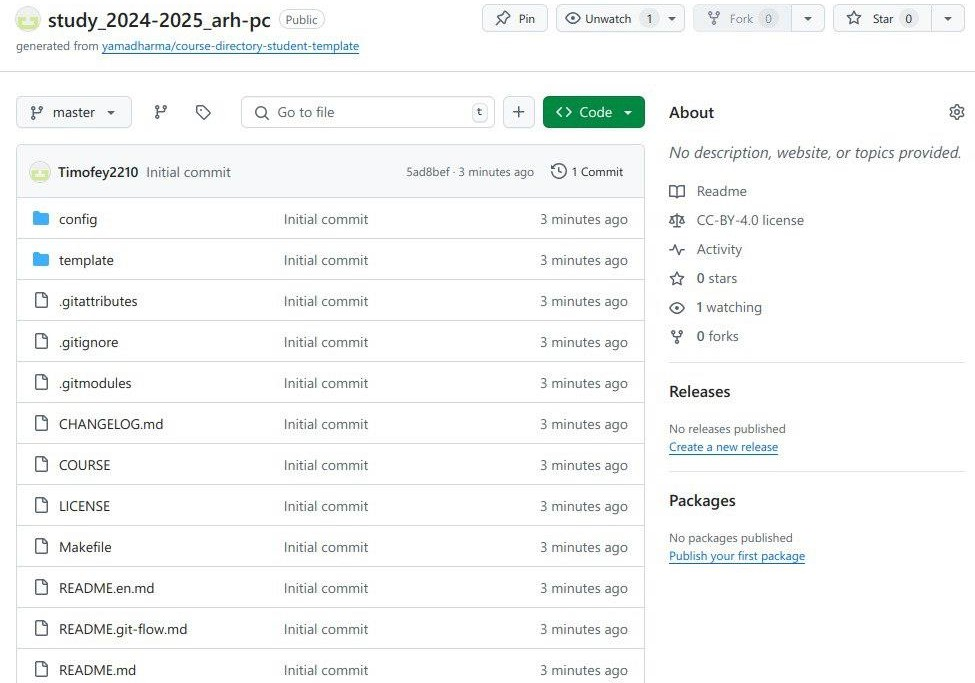{#fig:012 width=70%}

После выполненных действий приступим к заданиям для самостоятельной работы. Для
начала создадим каталоги labs>lab02>report и labs>lab01>report(рис. [-@fig:013])

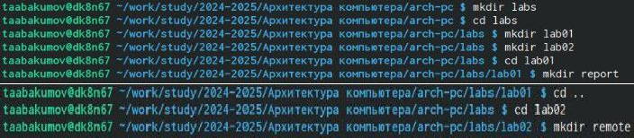{#fig:013 width=70%}

Скопируем отчеты по выполнению предыдущих лабораторных работ в соответствующие
каталоги созданного рабочего пространства и загрузим файлы на github(рис. [-@fig:014])

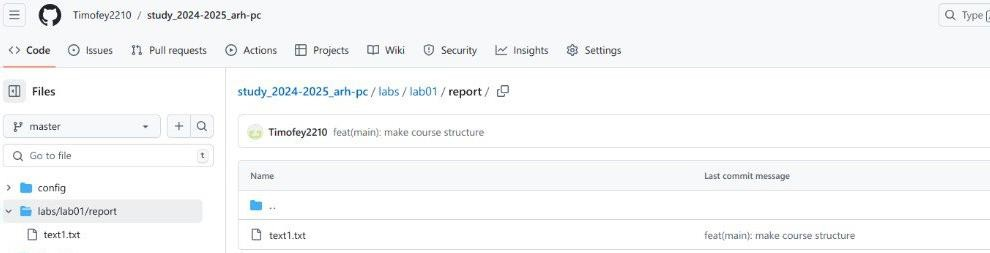{#fig:014 width=70%}

(рис. [-@fig:015])

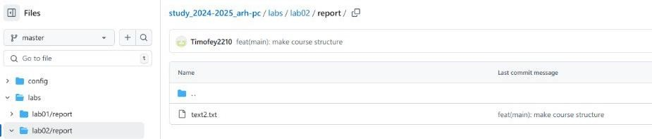{#fig:015 width=70%}

# Вывод

В ходе выполнения этой я исследовал концепции и познакомился с использованием систем контроля версий, а также приобрёл практические навыки работы с git.

