---
## Front matter
title: "Отчёт по лабораторной работе №3"
subtitle: "Дисциплина: Архитектура компьютера"
author: "Абакумов Тимофей Александрович"

## Generic otions
lang: ru-RU
toc-title: "Содержание"

## Bibliography
bibliography: bib/cite.bib
csl: pandoc/csl/gost-r-7-0-5-2008-numeric.csl

## Pdf output format
toc: true # Table of contents
toc-depth: 2
lof: true # List of figures
lot: true # List of tables
fontsize: 12pt
linestretch: 1.5
papersize: a4
documentclass: scrreprt
## I18n polyglossia
polyglossia-lang:
  name: russian
  options:
	- spelling=modern
	- babelshorthands=true
polyglossia-otherlangs:
  name: english
## I18n babel
babel-lang: russian
babel-otherlangs: english
## Fonts
mainfont: IBM Plex Serif
romanfont: IBM Plex Serif
sansfont: IBM Plex Sans
monofont: IBM Plex Mono
mathfont: STIX Two Math
mainfontoptions: Ligatures=Common,Ligatures=TeX,Scale=0.94
romanfontoptions: Ligatures=Common,Ligatures=TeX,Scale=0.94
sansfontoptions: Ligatures=Common,Ligatures=TeX,Scale=MatchLowercase,Scale=0.94
monofontoptions: Scale=MatchLowercase,Scale=0.94,FakeStretch=0.9
mathfontoptions:
## Biblatex
biblatex: true
biblio-style: "gost-numeric"
biblatexoptions:
  - parentracker=true
  - backend=biber
  - hyperref=auto
  - language=auto
  - autolang=other*
  - citestyle=gost-numeric
## Pandoc-crossref LaTeX customization
figureTitle: "Рис."
tableTitle: "Таблица"
listingTitle: "Листинг"
lofTitle: "Список иллюстраций"
lotTitle: "Список таблиц"
lolTitle: "Листинги"
## Misc options
indent: true
header-includes:
  - \usepackage{indentfirst}
  - \usepackage{float} # keep figures where there are in the text
  - \floatplacement{figure}{H} # keep figures where there are in the text
---

# Цель работы

Целью работы является освоение процедуры оформления отчетов с помощью легковесного
языка разметки Markdowйn.

# Задание

**Порядок выполнения лабораторной работы**
1. Откройте терминал
2. Перейдите в каталог курса сформированный при выполнении лабораторной работы №2:
cd ~/work/study/2023-2024/"Архитектура компьютера"/arch-pc/
Обновите локальный репозиторий, скачав изменения из удаленного репозитория с помощью команды git pull
3. Перейдите в каталог с шаблоном отчета по лабораторной работе № 3
cd ~/work/study/2023-2024/"Архитектура компьютера"/arch-pc/labs/lab03/report
4. Проведите компиляцию шаблона с использованием Makefile. Для этого введите команду
make
При успешной компиляции должны сгенерироваться файлы report.pdf и report.docx.
Откройте и проверьте корректность полученных файлов.
5. Удалите полученный файлы с использованием Makefile. Для этого введите команду
make clean
Проверьте, что после этой команды файлы report.pdf и report.docx были удалены.
6. Откройте файл report.md c помощью любого текстового редактора, например gedit
gedit report.md
Внимательно изучите структуру этого файла.
7. Заполните отчет и скомпилируйте отчет с использованием Makefile. Проверьте корректность полученных файлов. (Обратите внимание, для корректного отображения
скриншотов они должны быть размещены в каталоге image)
8. Загрузите файлы на Github.
cd ~/work/study/2023-2024/"Архитектура компьютера"/arch-pc
git add .
git commit -am 'feat(main): add files lab-3'
git push

**Задание для самостоятельной работы**
1. В соответствующем каталоге сделайте отчёт по лабораторной работе № 2 в формате
Markdown. В качестве отчёта необходимо предоставить отчёты в 3 форматах: pdf, docx
и md.
2. Загрузите файлы на github.

# Выполнение лабораторной работы

## Заполнение отчета по выполнению лабораторной работы №4 с помощью языка разметки Markdown

Открываю терминал. Перехожу в каталог курса, сформированный при выполненнии прошлой лаборатной работы (рис. [-@fig:001]).

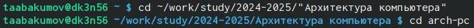{ #fig:001 width=70% }

Обновляю локальный репозиторий, скачав изменения из удаленного репозитория с помощью команды git pull (рис. [-@fig:002]).

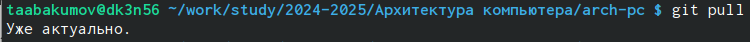{ #fig:002 width=70% }

Перехожу в каталог с шаблоном отчета по лабораторной работе №4 с помощью cd (рис. [-@fig:003]).

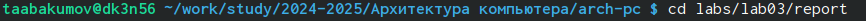{ #fig:003 width=70% }

Компилирую шаблон с использованием Makefile, вводя команду make (рис. [-@fig:004]).

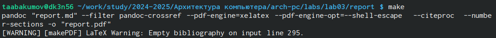{ #fig:004 width=70% }

Убедимся, что все правильно сгенерировалось (рис. [## Задание для самостоятельной работы-@fig:005]).

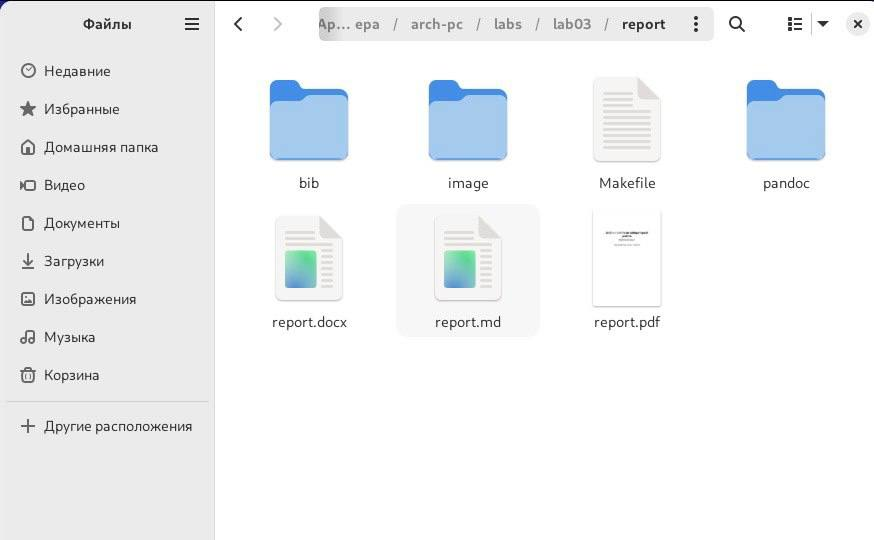{ #fig:005 width=70% }

Удаляю полученные файлы с использованием Makefile, вводя команду make clean (рис. [-@fig:006]). С помощью команды ls проверяю, удалились ли созданные файлы.

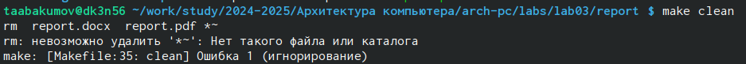{ #fig:006 width=70% }

Открою файл report.md c помощью любого текстового редактора, например gedit
gedit report.md(рис. [-@fig:007]).

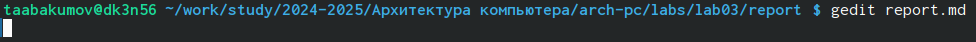{ #fig:007 width=70% }

Начинаю заполнять отчет с помощью языка разметки Markdown в скопированном файле (рис. [-@fig:008]).

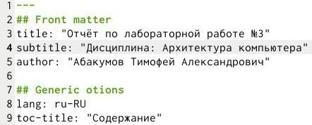{ #fig:008 width=70% }

Компилирую файл с отчетом. Загружаю отчет на GitHub.

## Задание для самостоятельной работы

Перехожу в директорию lab03/report с помощью cd, чтобы там заполнять отчет по третьей лабораторной работе(рис. [-@fig:009]).

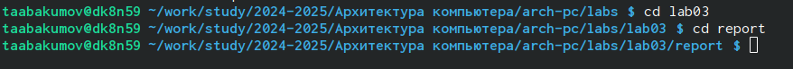{ #fig:009 width=70% }

Копирую файл report.md с новым именем для заполненния отчета (рис. [-@fig:010]).

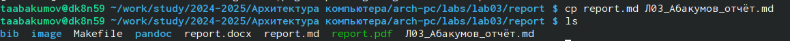{ #fig:010 width=70% }

Открываю файл с помощью текстового редактора gedit и начинаю заполнять отчет (рис. [-@fig:011]).

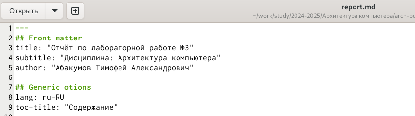{ #fig:011 width=70% }

Удаляю предыдущий файл отчета, чтобы при компиляции он мне не мешал (рис. [-@fig:012]).

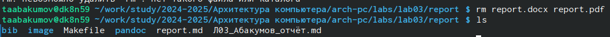{ #fig:012 width=70% }

Компилирую файл с отчетом по лабораторной работе (рис. [-@fig:013]).

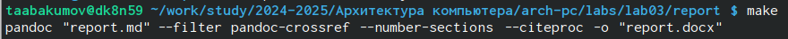{ #fig:013 width=70% }

Добавляю изменения на GitHub с помощью комнадой git add и сохраняю изменения с помощью commit ([-@fig:014]).

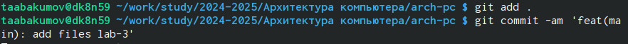{ #fig:014 width=70% }

Отправлялю файлы на сервер с помощью команды git pull ([-@fig:015]).

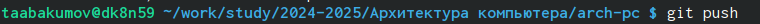{ #fig:015 width=70% }

# Выводы

В результате выполнения данной лабораторной работы я освоил процедуры оформления отчетов с помощью легковесного языка разметки Markdown.

