---
## Front matter
title: "Отчёт по лабораторной работе №5"
subtitle: "Дисциплина: Архитектура компьютера"
author: "Абакумов Тимофей Александрович"

## Generic otions
lang: ru-RU
toc-title: "Содержание"

## Bibliography
bibliography: bib/cite.bib
csl: pandoc/csl/gost-r-7-0-5-2008-numeric.csl

## Pdf output format
toc: true # Table of contents
toc-depth: 2
lof: true # List of figures
lot: true # List of tables
fontsize: 12pt
linestretch: 1.5
papersize: a4
documentclass: scrreprt
## I18n polyglossia
polyglossia-lang:
  name: russian
  options:
	- spelling=modern
	- babelshorthands=true
polyglossia-otherlangs:
  name: english
## I18n babel
babel-lang: russian
babel-otherlangs: english
## Fonts
mainfont: IBM Plex Serif
romanfont: IBM Plex Serif
sansfont: IBM Plex Sans
monofont: IBM Plex Mono
mathfont: STIX Two Math
mainfontoptions: Ligatures=Common,Ligatures=TeX,Scale=0.94
romanfontoptions: Ligatures=Common,Ligatures=TeX,Scale=0.94
sansfontoptions: Ligatures=Common,Ligatures=TeX,Scale=MatchLowercase,Scale=0.94
monofontoptions: Scale=MatchLowercase,Scale=0.94,FakeStretch=0.9
mathfontoptions:
## Biblatex
biblatex: true
biblio-style: "gost-numeric"
biblatexoptions:
  - parentracker=true
  - backend=biber
  - hyperref=auto
  - language=auto
  - autolang=other*
  - citestyle=gost-numeric
## Pandoc-crossref LaTeX customization
figureTitle: "Рис."
tableTitle: "Таблица"
listingTitle: "Листинг"
lofTitle: "Список иллюстраций"
lotTitle: "Список таблиц"
lolTitle: "Листинги"
## Misc options
indent: true
header-includes:
  - \usepackage{indentfirst}
  - \usepackage{float} # keep figures where there are in the text
  - \floatplacement{figure}{H} # keep figures where there are in the text
---

# Цель работы

Приобретение практических навыков работы в Midnight Commander. Освоение инструкций
языка ассемблера mov и int

# Задание

**Порядок выполнения лабораторной работы**

1. Основы работы с mc
2. Структура программы на языке ассемблера NASM
3. Подключение внешнего файла
4. Выполнение заданий для самостоятельной работы

# Выполнение лабораторной работы

## Основы работы с mc

1. Для начала откроем Midnight Commander с помощью команды mc (рис. [-@fig:001]).

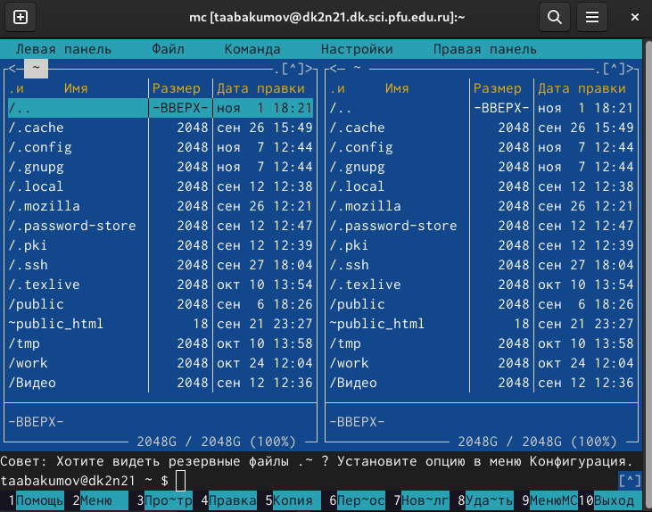{ #fig:001 width=70% }

2. Пользуясь клавишами ↑ , ↓ и Enter перейдём в каталог ~/work/study/2024-2025/arch-pc/labs/lab05 (рис. [-@fig:002]).

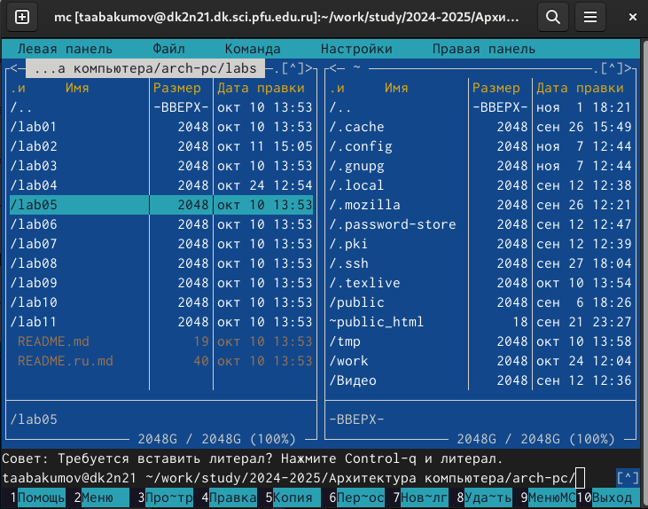{ #fig:002 width=70% }

3. Пользуясь строкой ввода и командой touch создадим файл lab5-1.asm (рис. [-@fig:003]).

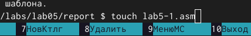{ #fig:003 width=70% }

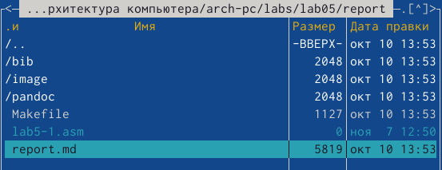{ #fig:004 width=70% }

## Структура программы на языке ассемблера NASM

4. С помощью функциональной клавиши F4 откройте файл lab5-1.asm для редактирования во встроенном редакторе (рис. [-@fig:005]).

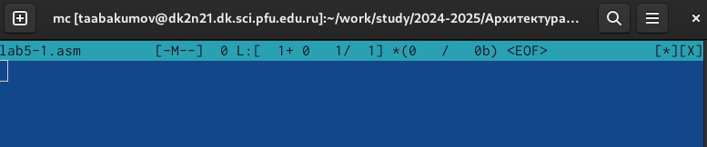{ #fig:005 width=70% }

5. Введём текст программы из листинга 5.1, затем сохраним изменения и закроем файл (рис. [-@fig:006]).

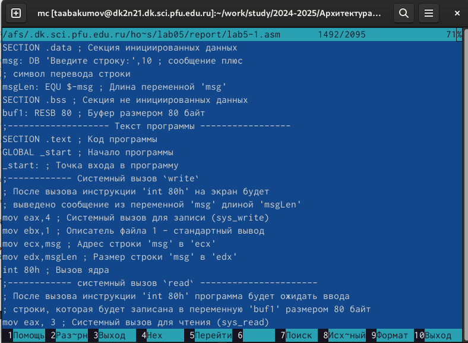{ #fig:006 width=70% }

6. Оттранслируем текст программы lab5-1.asm в объектный файл. Выполним компоновку объектного файла и запустим получившийся исполняемый файл. Программа выводит строку 'Введите строку:' и ожидает ввода с клавиатуры. На запрос введём свою ФИО (рис. [-@fig:007]).

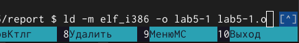{ #fig:007 width=70% }

{ #fig:008 width=70% }

{ #fig:009 width=70% }

## Подключение внешнего файла

9. Скачаем файл in_out.asm со страницы курса в ТУИС (рис. [-@fig:010]).

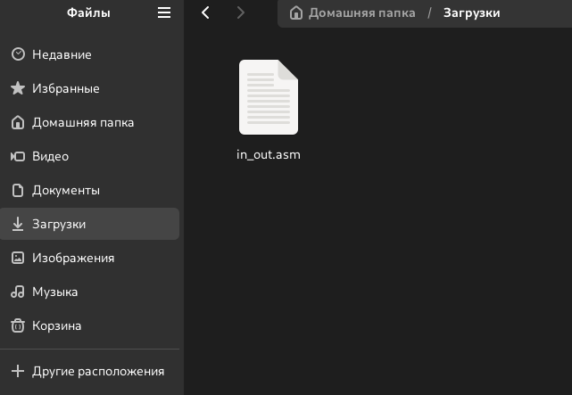{ #fig:010 width=70% }

10. Подключаемый файл in_out.asm должен лежать в том же каталоге, что и файл с про-
граммой, в которой он используется, поэтому перемещаем его из папки Загрузки (рис. [-@fig:011]).

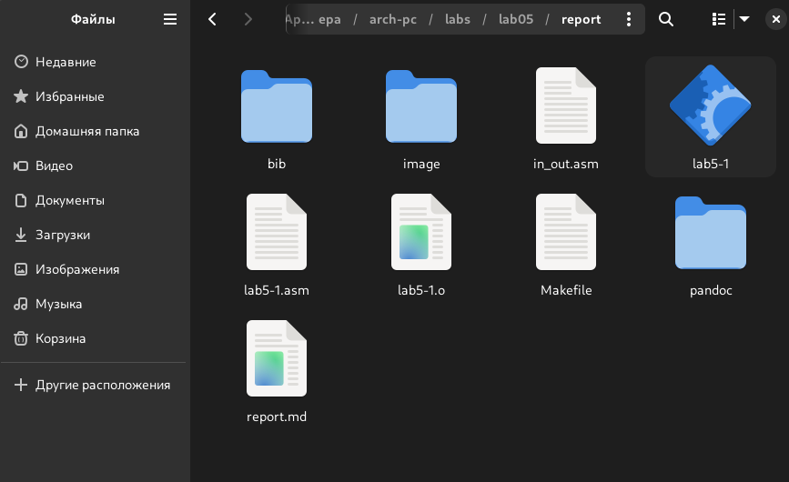{ #fig:011 width=70% }

11. 1. С помощью функциональной клавиши F5 создадим копию файла lab5-1.asm с именем
lab5-2.asm. Выделим файл lab5-1.asm, нажмём клавишу F5, введём имя файла lab5-2.asm и нажмём клавишу Enter (рис. [-@fig:012]).

{ #fig:012 width=70% }

(рис. [-@fig:013]).

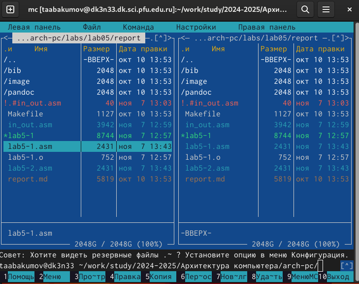{ #fig:013 width=70% }

12. Исправим текст программы в файле lab5-2.asm с использованием подпрограмм из внешнего файла in_out.asm (используем подпрограммы sprintLF, sread и quit) в соответствии с листингом 5.2. Создадим исполняемый файл и проверим его работу (рис. [-@fig:014]).

{ #fig:014 width=70% }

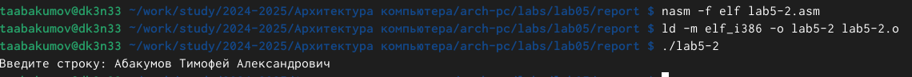{ #fig:015 width=70% }

## Задания для самостоятельной работы

1. Создадим копию файла lab5-1.asm. Внесём изменения в программу (без использования внешнего файла
in_out.asm), так чтобы она работала по следующему алгоритму:
• вывести приглашение типа “Введите строку:”;
• ввести строку с клавиатуры;
• вывести введённую строку на экран. Проверим работу исполняемого файла. На приглашение ввести строку введём свою ФИО.(рис. [-@fig:016]).

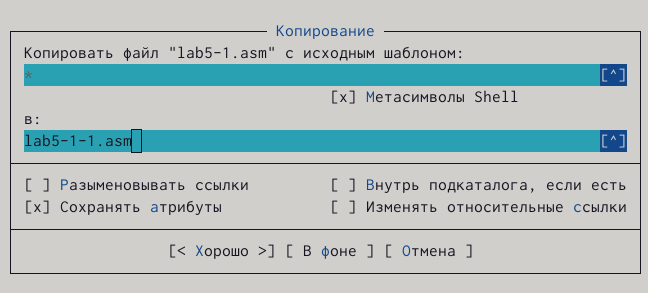{ #fig:016 width=70% }

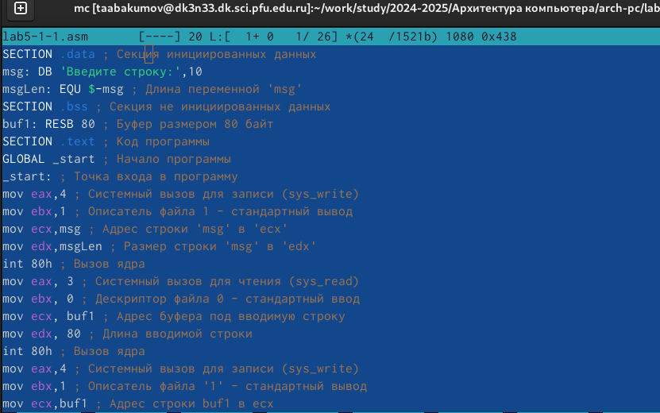{ #fig:017 width=70% }

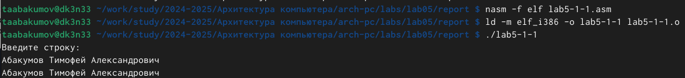{ #fig:018 width=70% }

Код программы из пункта 1:

SECTION .data ; Секция инициированных данных

msg: DB 'Введите строку:',10

msgLen: EQU $-msg ; Длина переменной 'msg'

SECTION .bss ; Секция не инициированных данных

buf1: RESB 80 ; Буфер размером 80 байт

SECTION .text ; Код программы

GLOBAL _start ; Начало программы

_start: ; Точка входа в программу

mov eax,4 ; Системный вызов для записи (sys_write)

mov ebx,1 ; Описатель файла 1 - стандартный вывод

mov ecx,msg ; Адрес строки 'msg' в 'ecx'

mov edx,msgLen ; Размер строки 'msg' в 'edx'

int 80h ; Вызов ядра

mov eax, 3 ; Системный вызов для чтения (sys_read)

mov ebx, 0 ; Дескриптор файла 0 - стандартный ввод

mov ecx, buf1 ; Адрес буфера под вводимую строку

mov edx, 80 ; Длина вводимой строки

int 80h ; Вызов ядра

mov eax,4 ; Системный вызов для записи (sys_write)

mov ebx,1 ; Описатель файла '1' - стандартный вывод

mov ecx,buf1 ; Адрес строки buf1 в ecx

mov edx,buf1 ; Размер строки buf1

int 80h ; Вызов ядра

mov eax,1 ; Системный вызов для выхода (sys_exit)

mov ebx,0 ; Выход с кодом возврата 0 (без ошибок)

int 80h ; Вызов ядра

2. Создадим копию файла lab5-2.asm. Исправим текст программы с использование подпрограмм из внешнего файла in_out.asm, так чтобы она работала по следующему алгоритму:
• вывести приглашение типа “Введите строку:”;
• ввести строку с клавиатуры;
• вывести введённую строку на экран (рис. [-@fig:019]).

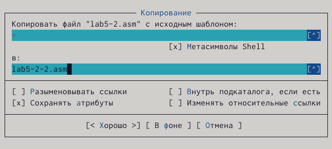{ #fig:019 width=70% }

{ #fig:020 width=70% }

Код программы из пункта 2:

%include 'in_out.asm'

SECTION .data ; Секция инициированных данных

msg: DB 'Введите строку: ',0h ; сообщение

SECTION .bss ; Секция не инициированных данных

buf1: RESB 80 ; Буфер размером 80 байт

SECTION .text ; Код программы

GLOBAL _start ; Начало программы

_start: ; Точка входа в программу

mov eax, msg ; запись адреса выводимого сообщения в `EAX`

call sprint ; вызов подпрограммы печати сообщения

mov ecx, buf1 ; запись адреса переменной в `EAX`

mov edx, 80 ; запись длины вводимого сообщения в `EBX`

call sread ; вызов подпрограммы ввода сообщения

mov eax,4 ; Системный вызов для записи (sys_write)

mov ebx,1 ; Описатель файла '1' - стандартный вывод

mov ecx,buf1 ; Адрес строки buf1 в ecx

int 80h ; Вызов ядра

call quit ; вызов подпрограммы завершения

# Выводы

При выполнении данной лабораторной работы я приобрела практические навыки работы в Midnight Commander, а также освоила инструкции языка ассемблера mov и int.

