---
## Front matter
title: "Отчёт по лабораторной работе №6"
subtitle: "Дисциплина: Архитектура компьютера"
author: "Абакумов Тимофей Александрович"

## Generic otions
lang: ru-RU
toc-title: "Содержание"

## Bibliography
bibliography: bib/cite.bib
csl: pandoc/csl/gost-r-7-0-5-2008-numeric.csl

## Pdf output format
toc: true # Table of contents
toc-depth: 2
lof: true # List of figures
lot: true # List of tables
fontsize: 12pt
linestretch: 1.5
papersize: a4
documentclass: scrreprt
## I18n polyglossia
polyglossia-lang:
  name: russian
  options:
	- spelling=modern
	- babelshorthands=true
polyglossia-otherlangs:
  name: english
## I18n babel
babel-lang: russian
babel-otherlangs: english
## Fonts
mainfont: IBM Plex Serif
romanfont: IBM Plex Serif
sansfont: IBM Plex Sans
monofont: IBM Plex Mono
mathfont: STIX Two Math
mainfontoptions: Ligatures=Common,Ligatures=TeX,Scale=0.94
romanfontoptions: Ligatures=Common,Ligatures=TeX,Scale=0.94
sansfontoptions: Ligatures=Common,Ligatures=TeX,Scale=MatchLowercase,Scale=0.94
monofontoptions: Scale=MatchLowercase,Scale=0.94,FakeStretch=0.9
mathfontoptions:
## Biblatex
biblatex: true
biblio-style: "gost-numeric"
biblatexoptions:
  - parentracker=true
  - backend=biber
  - hyperref=auto
  - language=auto
  - autolang=other*
  - citestyle=gost-numeric
## Pandoc-crossref LaTeX customization
figureTitle: "Рис."
tableTitle: "Таблица"
listingTitle: "Листинг"
lofTitle: "Список иллюстраций"
lotTitle: "Список таблиц"
lolTitle: "Листинги"
## Misc options
indent: true
header-includes:
  - \usepackage{indentfirst}
  - \usepackage{float} # keep figures where there are in the text
  - \floatplacement{figure}{H} # keep figures where there are in the text
---

# Цель работы

Освоение арифметических инструкций языка ассемблера NASM.

# Задание

**Порядок выполнения лабораторной работы**

1. Символьные и численные данные в NASM.
2. Выполнение арифметических операций в NASM.
3. Выполнение заданий для самостоятельной работы.

# Выполнение лабораторной работы

## Символьные и численные данные в NASM

1. Для начала создадим каталог для программам лабораторной работы № 6, перейдём в него и создадим файл lab6-1.asm с помощью утилиты touch (рис. [-@fig:001]).

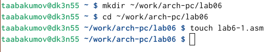{ #fig:001 width=70% }

2. Копирую в текущий каталог файл in_out.asm с помощью утилиты cp, т.к. он будет использоваться в других программах (рис. [-@fig:002]).

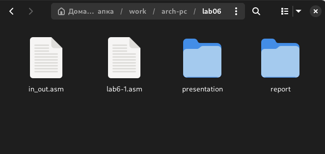{ #fig:002 width=70% }

3. После этого откроем созданный файл lab6-1.asm, вставим в него программу вывода значения регистра eax (рис. [-@fig:003]).

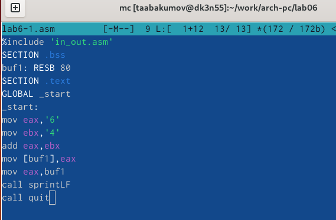{ #fig:003 width=70% }

Код программы из пункта 3:
 
%include 'in_out.asm'

SECTION .bss

buf1: RESB 80

SECTION .text

GLOBAL _start

_start:

mov eax,'6'

mov ebx,'4'

add eax,ebx

mov [buf1],eax

mov eax,buf1

call sprintLF

call quit

4. Создадим исполняемый файл программы и запустим его. Вывод программы: символ j, потому что программа вывела символ, соответствующий по системе ASCII сумме двоичных кодов символов 4 и 6 (рис. [-@fig:004]).

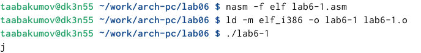{ #fig:004 width=70% }

5. Далее изменим в тексте программы символы "6" и "4" на цифры 6 и 4 (рис. [-@fig:005]).

{ #fig:005 width=70% }

6. Создадим новый исполняемый файл программы и запустим его. Теперь вывелся символ с кодом 10, это символ перевода строки, этот символ не отображается при выводе на экран (рис. [-@fig:006]).

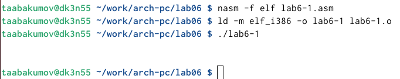{ #fig:006 width=70% }

7. Создадим новый файл lab6-2.asm с помощью утилиты touch (рис. [-@fig:007]).

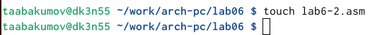{ #fig:007 width=70% }

8. Введём в файл текст другой программы для вывода значения регистра eax (рис. [-@fig:008]).

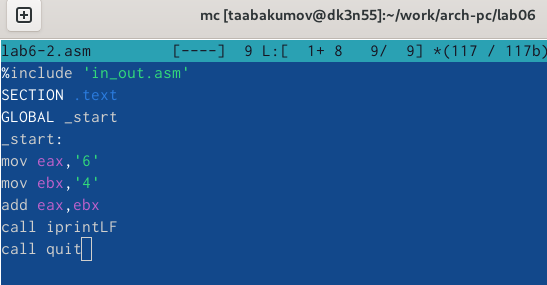{ #fig:008 width=70% }

Код программы из пункта 8:

%include 'in_out.asm'

SECTION .text

GLOBAL _start

_start:

mov eax,'6'

mov ebx,'4'

add eax,ebx

call iprintLF

call quit

9. Создадим и запустим исполняемый файл lab6-2 (рис. [-@fig:010]). Теперь вывод число 106, потому что программа позволяет вывести именно число, а не символ, хотя все еще происходит именно сложение кодов символов "6" и "4" (рис. [-@fig:009]).

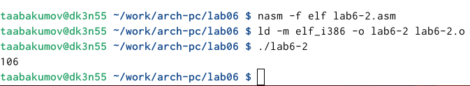{ #fig:009 width=70% }

10. Заменим в тексте программы в файле lab6-2.asm символы "6" и "4" на числа 6 и 4. Заменим в тексте программы функцию iprintLF на iprint (рис. [-@fig:013]). (рис. [-@fig:010]).

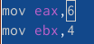{ #fig:010 width=70% }

11. Создадим и запустим новый исполняемый файл.Теперь программа складывает не соответствующие символам коды в системе ASCII, а сами числа, поэтому вывод 10 (рис. [-@fig:011]).

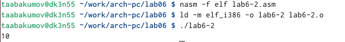{ #fig:011 width=70% }

## Выполнение арифметических операций в NASM

12. Создадим файл lab6-3.asm с помощью утилиты touch (рис. [-@fig:012]).

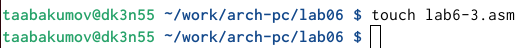{ #fig:012 width=70% }

13. Введём в созданный файл текст программы для вычисления значения выражения f(x) = (5 * 2 + 3)/3 (рис. [-@fig:013]).

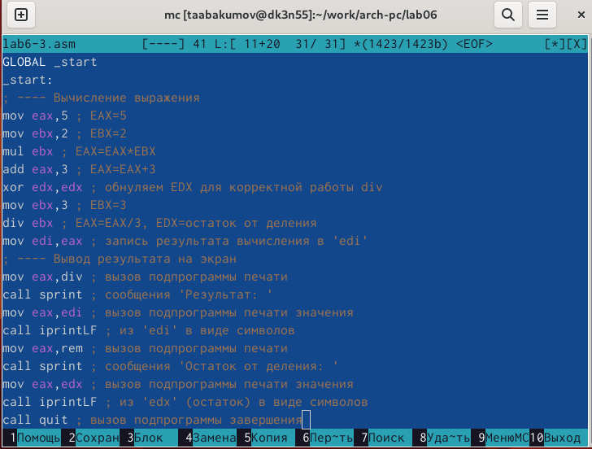{ #fig:013 width=70% }

Код программы из пункта 13:

%include 'in_out.asm' ; подключение внешнего файла

SECTION .data

div: DB 'Результат: ',0

rem: DB 'Остаток от деления: ',0

SECTION .text

GLOBAL _start

_start:

mov eax,5 ; EAX=5

mov ebx,2 ; EBX=2

mul ebx ; EAX=EAX*EBX

add eax,3 ; EAX=EAX+3

xor edx,edx ; обнуляем EDX для корректной работы div

mov ebx,3 ; EBX=3

div ebx ; EAX=EAX/3, EDX=остаток от деления

mov edi,eax ; запись результата вычисления в 'edi'

mov eax,div ; вызов подпрограммы печати

call sprint ; сообщения 'Результат: '

mov eax,edi ; вызов подпрограммы печати значения

call iprintLF ; из 'edi' в виде символов

mov eax,rem ; вызов подпрограммы печати

call sprint ; сообщения 'Остаток от деления: '

mov eax,edx ; вызов подпрограммы печати значения

call iprintLF ; из 'edx' (остаток) в виде символов

call quit ; вызов подпрограммы завершения

14. Создаю исполняемый файл и запускаю его (рис. [-@fig:014]).

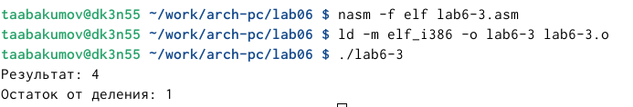{ #fig:014 width=70% }

15. Изменим программу так, чтобы она вычисляла значение выражения f(x) = (4 * 6 + 2)/5 (рис. [-@fig:015]).

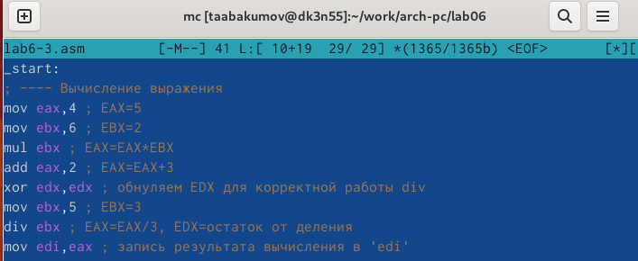{ #fig:015 width=70% }

16. Создадим и запустм новый исполняемый файл. Я посчитал для проверки правильности работы программы значение выражения самостоятельно, программа отработала верно (рис. [-@fig:016]).

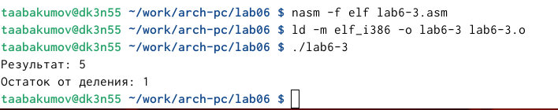{ #fig:016 width=70% }

17. Создадим файл variant.asm с помощью утилиты touch (рис. [-@fig:017]).

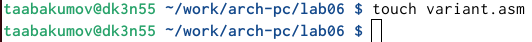{ #fig:017 width=70% }

18. Введём в файл текст программы для вычисления варианта задания по номеру студенческого билета (рис. [-@fig:018]).

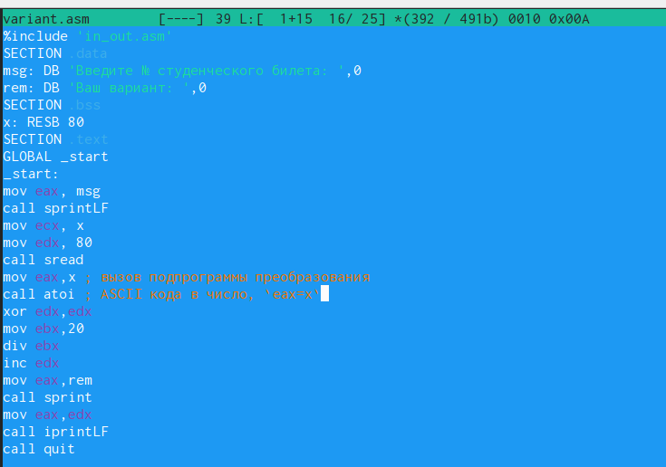{ #fig:018 width=70% }

Код программы из пункта 18:

%include 'in_out.asm'

SECTION .data

msg: DB 'Введите № студенческого билета: ',0

rem: DB 'Ваш вариант: ',0

SECTION .bss

x: RESB 80

SECTION .text

GLOBAL _start

_start:

mov eax, msg

call sprintLF

mov ecx, x

mov edx, 80

call sread

mov eax,x ; вызов подпрограммы преобразования

call atoi ; ASCII кода в число, `eax=x`

xor edx,edx

mov ebx,20

div ebx

inc edx

mov eax,rem

call sprint

mov eax,edx

call iprintLF

call quit

19. Создаю и запускаю исполняемый файл. Ввожу номер своего студ. билета с клавиатуры, программа вывела, что мой вариант - 9 (рис. [-@fig:019]).

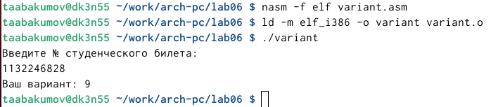{ #fig:019 width=70% }

## Выполнение заданий для самостоятельной работы

20. Создадим файл lab6-4.asm с помощью утилиты touch (рис. [-@fig:020]).

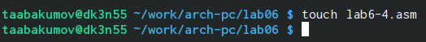{ #fig:020 width=70% }

21. Откроем созданный файл для редактирования, введём в него текст программы для вычисления значения выражения 10+(31х-5). Это выражение было под вариантом 9 (рис. [-@fig:021]).

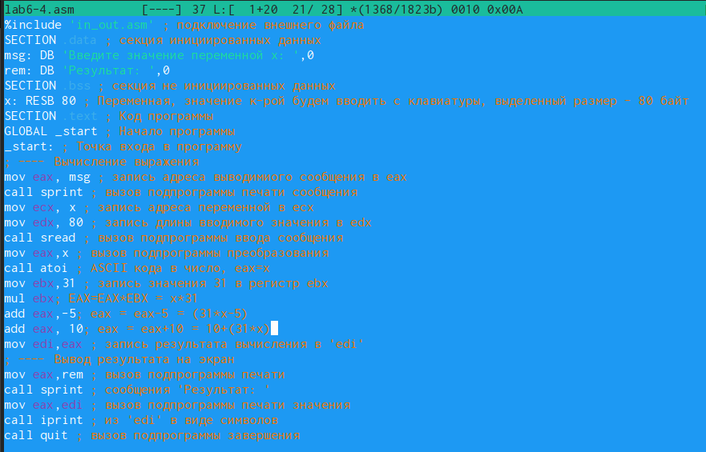{ #fig:021 width=70% }

22. Создаю и запускаю исполняемый файл. При вводе значения 1, вывод - 36. Проведём еще один запуск исполняемого файла для проверки работы программы с другим значением на входе. При вводе значения 3, вывод - 98. Программа отработала верно (рис. [-@fig:022]).

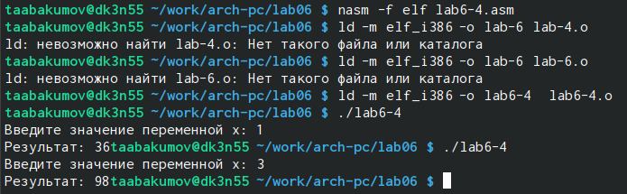{ #fig:022 width=70% }

# Выводы

При выполнении данной лабораторной работы я освоил арифметические инструкции языка ассемблера NASM.

