---
## Front matter
title: "Отчёт по лабораторной работе №7"
subtitle: "Дисциплина: Архитектура компьютера"
author: "Абакумов Тимофей Александрович"

## Generic otions
lang: ru-RU
toc-title: "Содержание"

## Bibliography
bibliography: bib/cite.bib
csl: pandoc/csl/gost-r-7-0-5-2008-numeric.csl

## Pdf output format
toc: true # Table of contents
toc-depth: 2
lof: true # List of figures
lot: true # List of tables
fontsize: 12pt
linestretch: 1.5
papersize: a4
documentclass: scrreprt
## I18n polyglossia
polyglossia-lang:
  name: russian
  options:
	- spelling=modern
	- babelshorthands=true
polyglossia-otherlangs:
  name: english
## I18n babel
babel-lang: russian
babel-otherlangs: english
## Fonts
mainfont: IBM Plex Serif
romanfont: IBM Plex Serif
sansfont: IBM Plex Sans
monofont: IBM Plex Mono
mathfont: STIX Two Math
mainfontoptions: Ligatures=Common,Ligatures=TeX,Scale=0.94
romanfontoptions: Ligatures=Common,Ligatures=TeX,Scale=0.94
sansfontoptions: Ligatures=Common,Ligatures=TeX,Scale=MatchLowercase,Scale=0.94
monofontoptions: Scale=MatchLowercase,Scale=0.94,FakeStretch=0.9
mathfontoptions:
## Biblatex
biblatex: true
biblio-style: "gost-numeric"
biblatexoptions:
  - parentracker=true
  - backend=biber
  - hyperref=auto
  - language=auto
  - autolang=other*
  - citestyle=gost-numeric
## Pandoc-crossref LaTeX customization
figureTitle: "Рис."
tableTitle: "Таблица"
listingTitle: "Листинг"
lofTitle: "Список иллюстраций"
lotTitle: "Список таблиц"
lolTitle: "Листинги"
## Misc options
indent: true
header-includes:
  - \usepackage{indentfirst}
  - \usepackage{float} # keep figures where there are in the text
  - \floatplacement{figure}{H} # keep figures where there are in the text
---

# Цель работы

Изучение команд условного и безусловного переходов. Приобретение навыков написания
программ с использованием переходов. Знакомство с назначением и структурой файла
листинга.

# Задание

**Порядок выполнения лабораторной работы**

1. Реализация переходов в NASM
2. Изучение структуры файлы листинга
3. Выполнение заданий для самостоятельной работы.

# Выполнение лабораторной работы

## Реализация переходов в NASM

1. Для начала создадим каталог для программ лабораторной работы № 7, перейдём в него и создадим файл lab7-1.asm (рис. [-@fig:001]).

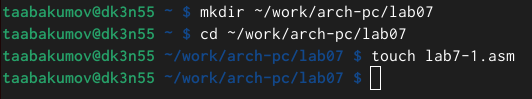{ #fig:001 width=70% }

2. Рассмотрим пример программы с использованием инструкции jmp. Введём в файл lab7-1.asm текст программы из листинга 7.1 (рис. [-@fig:002]).

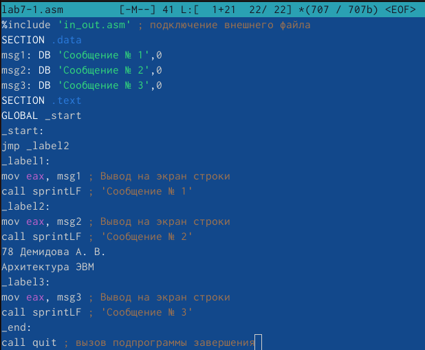{ #fig:002 width=70% }

Код программы из пункта 2:

%include 'in_out.asm' ; подключение внешнего файла

SECTION .data

msg1: DB 'Сообщение № 1',0

msg2: DB 'Сообщение № 2',0

msg3: DB 'Сообщение № 3',0

SECTION .text

GLOBAL _start

_start:

jmp _label2

_label1:

mov eax, msg1 ; Вывод на экран строки

call sprintLF ; 'Сообщение № 1'

_label2:

mov eax, msg2 ; Вывод на экран строки

call sprintLF ; 'Сообщение № 2'

_label3:

mov eax, msg3 ; Вывод на экран строки

call sprintLF ; 'Сообщение № 3'

_end:

call quit ; вызов подпрограммы завершения

3. Создадим исполняемый файл и запустим его. Результат работы данной программы будет следующим (рис. [-@fig:003]).

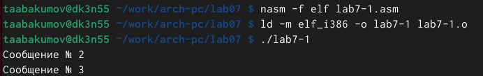{ #fig:003 width=70% }

Таким образом, использование инструкции jmp _label2 меняет порядок исполнения
инструкций и позволяет выполнить инструкции начиная с метки _label2, пропустив вывод
первого сообщения.

4.  Изменим программу таким образом, чтобы она выводила сначала ‘Сообщение № 2’, потом ‘Сообщение № 1’ и завершала работу. Изменим текст программы в соответствии с листингом 7.2 (рис. [-@fig:004]).

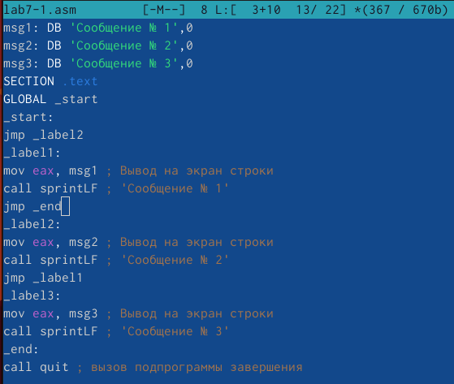{ #fig:004 width=70% }

Код программы из пункта 4:

%include 'in_out.asm' ; подключение внешнего файла

SECTION .data

msg1: DB 'Сообщение № 1',0

msg2: DB 'Сообщение № 2',0

msg3: DB 'Сообщение № 3',0

SECTION .text

GLOBAL _start

_start:

jmp _label2

_label1:

mov eax, msg1 ; Вывод на экран строки

call sprintLF ; 'Сообщение № 1'

jmp _end

_label2:

mov eax, msg2 ; Вывод на экран строки

call sprintLF ; 'Сообщение № 2'

jmp _label1

_label3:

mov eax, msg3 ; Вывод на экран строки

call sprintLF ; 'Сообщение № 3'

_end:

call quit ; вызов подпрограммы завершения

5. Создадим исполняемый файл и проверим его работу (рис. [-@fig:005]).

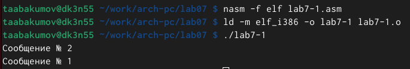{ #fig:005 width=70% }

6. Измените текст программы добавив или изменив инструкции jmp, чтобы вывод програм-
мы был следующим:
user@dk4n31:~$ ./lab7-1
Сообщение № 3
Сообщение № 2
Сообщение № 1
user@dk4n31:~$ (рис. [-@fig:006]).

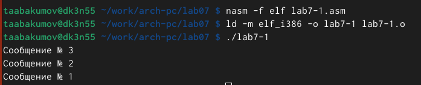{ #fig:006 width=70% }

(рис. [-@fig:007]).

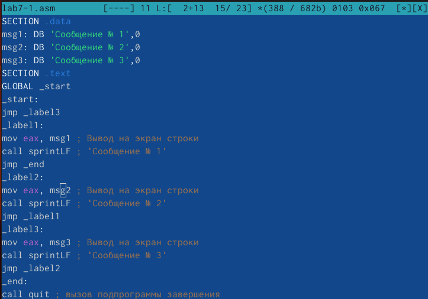{ #fig:007 width=70% }

Код программы из пункта 6:

%include 'in_out.asm' ; подключение внешнего файла

SECTION .data

msg1: DB 'Сообщение № 1',0

msg2: DB 'Сообщение № 2',0

msg3: DB 'Сообщение № 3',0

SECTION .text

GLOBAL _start

_start:

jmp _label3

_label1:

mov eax, msg1 ; Вывод на экран строки

call sprintLF ; 'Сообщение № 1'

jmp _end

_label2:

mov eax, msg2 ; Вывод на экран строки

call sprintLF ; 'Сообщение № 2'

jmp _label1

_label3:

mov eax, msg3 ; Вывод на экран строки

call sprintLF ; 'Сообщение № 3'

jmp _label2

_end:

call quit ; вызов подпрограммы завершения

7. Далее создадим файл lab7-2.asm в каталоге ~/work/arch-pc/lab07. Внимательно изучим текст программы из листинга 7.3 и введём в lab7-2.asm (рис. [-@fig:008]).

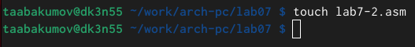{ #fig:008 width=70% }

Код программы из пункта 7:

%include 'in_out.asm'

section .data

msg1 db 'Введите B: ',0h

msg2 db "Наибольшее число: ",0h

A dd '20'

C dd '50'

section .bss

max resb 10

B resb 10

section .text

global _start

_start:

; ---------- Вывод сообщения 'Введите B: '

mov eax,msg1

call sprint

; ---------- Ввод 'B'

mov ecx,B

mov edx,10

call sread

; ---------- Преобразование 'B' из символа в число

mov eax,B

call atoi ; Вызов подпрограммы перевода символа в число

mov [B],eax ; запись преобразованного числа в 'B'

; ---------- Записываем 'A' в переменную 'max'

mov ecx,[A] ; 'ecx = A'

mov [max],ecx ; 'max = A'

; ---------- Сравниваем 'A' и 'С' (как символы)

cmp ecx,[C] ; Сравниваем 'A' и 'С'

jg check_B ; если 'A>C', то переход на метку 'check_B',

mov ecx,[C] ; иначе 'ecx = C'

mov [max],ecx ; 'max = C'

; ---------- Преобразование 'max(A,C)' из символа в число

check_B:

mov eax,max

call atoi ; Вызов подпрограммы перевода символа в число

mov [max],eax ; запись преобразованного числа в `max`

; ---------- Сравниваем 'max(A,C)' и 'B' (как числа)

mov ecx,[max]

cmp ecx,[B] ; Сравниваем 'max(A,C)' и 'B'

jg fin ; если 'max(A,C)>B', то переход на 'fin',

mov ecx,[B] ; иначе 'ecx = B'

mov [max],ecx

; ---------- Вывод результата

fin:

mov eax, msg2

call sprint ; Вывод сообщения 'Наибольшее число: '

mov eax,[max]

call iprintLF ; Вывод 'max(A,B,C)'

call quit ; Выход

8. Создадим исполняемый файл и проверим его работу для разных значений (рис. [-@fig:009]).

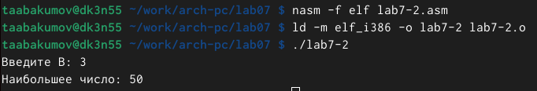{ #fig:009 width=70% }

Обратим внимание, в данном примере переменные A и С сравниваются как символы, а переменная B и максимум из A и С как числа (для этого используется функция atoi преобразования символа в число).

## Изучение структуры файлы листинга

9. Создадим файл листинга для программы из файла lab7-2.asm, а затем откроем файл листинга lab7-2.lst с помощью текстового редактора mcedit:(рис. [-@fig:010]).

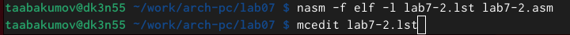{ #fig:010 width=70% }

10. Откроем файл с программой lab7-2.asm и в любой инструкции с двумя операндами
удалим один операнд, после чего выполним трансляцию с получением файла листинг (рис. [-@fig:011]).

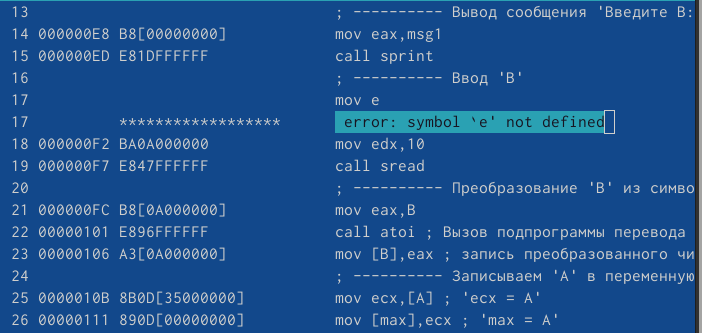{ #fig:011 width=70% }

## Выполнение заданий для самостоятельной работы

11. 1 Задание: Написать программу нахождения наименьшей из 3 целочисленных переменных a,b и c. Значения переменных выбрать из табл. 7.5 в соответствии с вариантом, полученным при выполнении лабораторной работы №6. Создать исполняемый файл и проверить его работу.

12. Для начала создадим файл lab7-3-1.asm. Мой вариант из прошлолй лабораторной работы - 9, соответственно программа должна выводить миниальное число среди чисел: 24,98,15 (рис. [-@fig:012]).

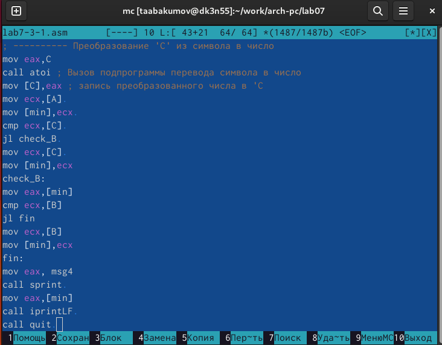{ #fig:012 width=70% }

Код программы из пункта 12:

include 'in_out.asm'

section .data

msg1 db 'Введите A: ',0h

msg2 db 'Введите В: ',0h

msg3 db 'Введите С: ',0h

msg4 db "Наименьшее число: ",0h

section .bss

min resb 10

A resb 10

B resb 10

C resb 10

section .text

global _start

_start:

; ---------- Вывод сообщения 'Введите A: '

mov eax,msg1

call sprint

; ---------- Ввод 'A'

mov ecx,A

mov edx,10

call sread

; ---------- Преобразование 'A' из символа в число

mov eax,A

call atoi ; Вызов подпрограммы перевода символа в число

mov [A],eax ; запись преобразованного числа в 'B'

; ---------- Вывод сообщения 'Введите B: '

mov eax,msg2

call sprint

; ---------- Ввод 'B'

mov ecx,B

mov edx,10

call sread

mov eax,B

call atoi

mov [B],eax

; ---------- Вывод сообщения 'Введите C: '

mov eax,msg3

call sprint

; ---------- Ввод 'C'

mov ecx,C

mov edx,10

call sread

; ---------- Преобразование 'C' из символа в число

mov eax,C

call atoi ; Вызов подпрограммы перевода символа в число

mov [C],eax ; запись преобразованного числа в 'C

mov ecx,[A] 

mov [min],ecx 

cmp ecx,[C] 

jl check_B 

mov ecx,[C] 

mov [min],ecx

check_B:

mov eax,[min]

cmp ecx,[B]

jl fin

mov ecx,[B]

mov [min],ecx

fin:

mov eax, msg4

call sprint 

mov eax,[min]

call iprintLF 

call quit 

13. Создадим исполняемый файл и проверим его работу (рис. [-@fig:013]).

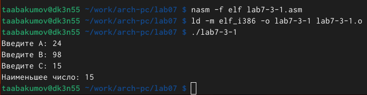{ #fig:013 width=70% }

14. 2 Задание: Написать программу, которая для введенных с клавиатуры значений x и a вычисляет
значение заданной функции f(x) и выводит результат вычислений. Вид функции f(x)
выбрать из таблицы 7.6 вариантов заданий в соответствии с вариантом, полученным
при выполнении лабораторной работы № 7. После этого необходимо создать исполняемый файл и проверьте
его работу для значений x и a из 7.6.

Для начала создадим файл lab7-3-2.asm (рис. [-@fig:014]).

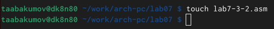{ #fig:014 width=70% }

15. Мой вариант из прошлолй лабораторной работы - 9, соответственно при вводе числа 5, должно выводиться число 7, и точно также при вводе числа 6, должно выводиться число 4 (рис. [-@fig:015]).

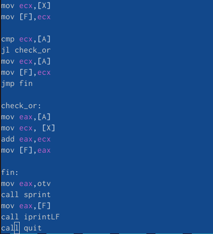{ #fig:015 width=70% }

Код программы из пункта 15:

%include 'in_out.asm'

SECTION .data

prim1 DB 'a+x ,x<=a' ,0

prim2 DB 'a, x>a',0

X1 DB 'Введите значение x:',0

A1 DB 'Введите значение a:',0

otv DB 'Ответ: ',0

SECTION .bss

X RESB 20

A RESB 20

F RESB 20

SECTION .text

GLOBAL _start

_start:

mov eax,prim1

call sprintLF

mov eax,prim2

call sprintLF

mov eax,X1

call sprint

mov ecx,X

mov edx,10

call sread

mov eax,X

call atoi

mov [X],eax

mov eax,A1

call sprint

mov ecx,A

mov edx,10

call sread

mov eax,A

call atoi

mov [A],eax

mov ecx,[X]

mov [F],ecx

cmp ecx,[A]

jl check_or

mov ecx,[A]

mov [F],ecx

jmp fin

check_or:

mov eax,[A]

mov ecx, [X]

add eax,ecx

mov [F],eax

fin:

mov eax,otv

call sprint

mov eax,[F]

call iprintLF

call quit

16. После написания программы создадим исполняемый файл (рис. [-@fig:016]).

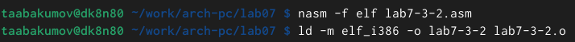{ #fig:016 width=70% }

17. Проверими работу программы (рис. [-@fig:017]).

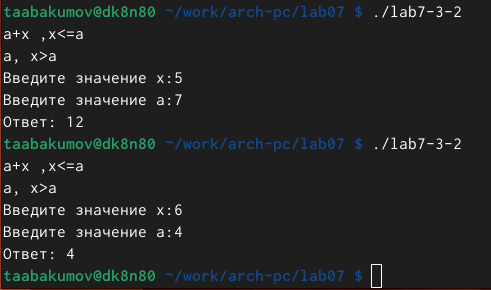{ #fig:017 width=70% }

# Выводы

Были изучены основные принципы работы с условным и безусловным переходом в assembler и изучены основы чтения файлов листинга.

