---
## Front matter
title: "Отчёт по лабораторной работе №8"
subtitle: "Дисциплина: Архитектура компьютера"
author: "Абакумов Тимофей Александрович"

## Generic otions
lang: ru-RU
toc-title: "Содержание"

## Bibliography
bibliography: bib/cite.bib
csl: pandoc/csl/gost-r-7-0-5-2008-numeric.csl

## Pdf output format
toc: true # Table of contents
toc-depth: 2
lof: true # List of figures
lot: true # List of tables
fontsize: 12pt
linestretch: 1.5
papersize: a4
documentclass: scrreprt
## I18n polyglossia
polyglossia-lang:
  name: russian
  options:
	- spelling=modern
	- babelshorthands=true
polyglossia-otherlangs:
  name: english
## I18n babel
babel-lang: russian
babel-otherlangs: english
## Fonts
mainfont: IBM Plex Serif
romanfont: IBM Plex Serif
sansfont: IBM Plex Sans
monofont: IBM Plex Mono
mathfont: STIX Two Math
mainfontoptions: Ligatures=Common,Ligatures=TeX,Scale=0.94
romanfontoptions: Ligatures=Common,Ligatures=TeX,Scale=0.94
sansfontoptions: Ligatures=Common,Ligatures=TeX,Scale=MatchLowercase,Scale=0.94
monofontoptions: Scale=MatchLowercase,Scale=0.94,FakeStretch=0.9
mathfontoptions:
## Biblatex
biblatex: true
biblio-style: "gost-numeric"
biblatexoptions:
  - parentracker=true
  - backend=biber
  - hyperref=auto
  - language=auto
  - autolang=other*
  - citestyle=gost-numeric
## Pandoc-crossref LaTeX customization
figureTitle: "Рис."
tableTitle: "Таблица"
listingTitle: "Листинг"
lofTitle: "Список иллюстраций"
lotTitle: "Список таблиц"
lolTitle: "Листинги"
## Misc options
indent: true
header-includes:
  - \usepackage{indentfirst}
  - \usepackage{float} # keep figures where there are in the text
  - \floatplacement{figure}{H} # keep figures where there are in the text
---

# Цель работы

Приобретение навыков написания программ с использованием циклов и обработкой
аргументов командной строки.

# Задание

**Порядок выполнения лабораторной работы**

1. Реализация циклов в NASM. 
2. Обработка аргументов командной строки.
3. Выполнение заданий для самостоятельной работы

# Выполнение лабораторной работы

## Реализация циклов в NASM

1. Для начала создадим каталог для программам лабораторной работы № 8, перейдём в него и создадим файл lab8-1.asm (рис. [-@fig:001]).

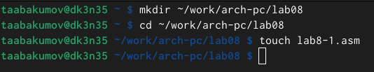{ #fig:001 width=70% }

2. Введём в файл lab8-1.asm текст программы из листинга 8.1 (рис. [-@fig:002]).

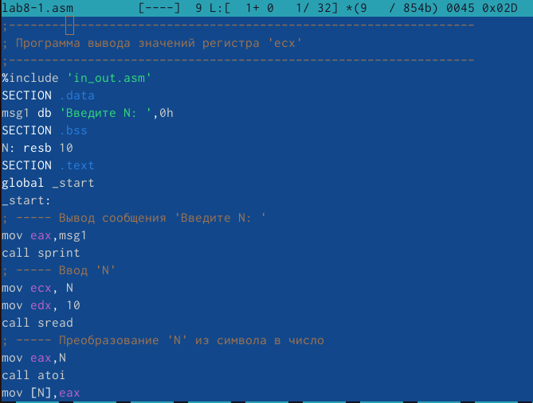{ #fig:002 width=70% }

Код программы из пункта 2:

%include "in_out.asm"

SECTION .data

msg db 'введите N: ', 0h

SECTION .bss

N: resb 10

SECTION .text

global _start

_start:

mov eax,msg

call sprint

mov ecx,N

mov edx,10

call sread

mov eax,N

call atoi

mov [N],eax

mov ecx,[N]

label:

mov [N],ecx

mov eax, [N]

call iprintLF

loop label 

call quit

3. Создадим исполняемый файл и проверим его работу (рис. [-@fig:003]).

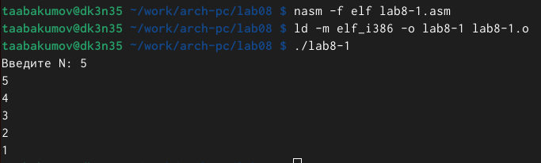{ #fig:003 width=70% }

4. Данный пример показывает, что использование регистра ecx в теле цилка loop может
привести к некорректной работе программы. Изменим текст программы добавив изменение
значение регистра ecx в цикл (рис. [-@fig:004]).

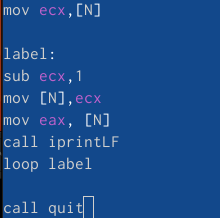{ #fig:004 width=70% }

5. Создадим исполняемый файл и проверим его работу (рис. [-@fig:005]).

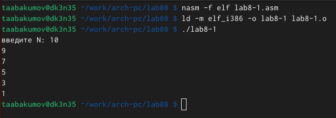{ #fig:005 width=70% }

Код программы из пункта 5:

%include "in_out.asm"

SECTION .data

msg db 'введите N: ', 0h

SECTION .bss

N: resb 10

SECTION .text

global _start

_start:

mov eax,msg

call sprint

mov ecx,N

mov edx,10

call sread

mov eax,N

call atoi

mov [N],eax

mov ecx,[N]

label:

sub ecx,1

mov [N],ecx

mov eax, [N]

call iprintLF

loop label 

call quit

6. Для использования регистра ecx в цикле и сохранения корректности работы программы
можно использовать стек. Внесём изменения в текст программы добавив команды push
и pop (добавления в стек и извлечения из стека) для сохранения значения счетчика цикла
loop (рис. [-@fig:006]).

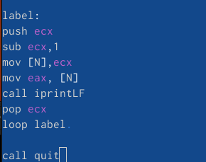{ #fig:006 width=70% }

Код программы из пункта 6:

%include "in_out.asm"

SECTION .data

msg db 'введите N: ', 0h

SECTION .bss

N: resb 10

SECTION .text

global _start

_start:

mov eax,msg

call sprint

mov ecx,N

mov edx,10

call sread

mov eax,N

call atoi

mov [N],eax

mov ecx,[N]

label:

push ecx 

sub ecx,1

mov [N],ecx

mov eax,[N]

call iprintLF

pop ecx

loop label

7. Создадим исполняемый файл и проверим его работу (рис. [-@fig:007]).

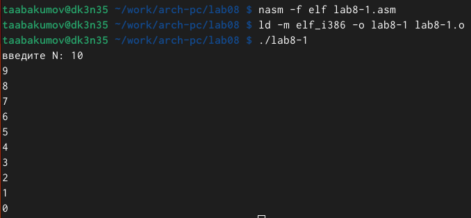{ #fig:007 width=70% }

## Обработка аргументов командной строки

8. Создадим файл lab8-2.asm в каталоге ~/work/arch-pc/lab08 и введём в него текст программы из листинга 8.2 (рис. [-@fig:008]).

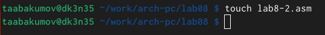{ #fig:008 width=70% }

9. Введём в него текст программы из листинга 8.2 (рис. [-@fig:009]).

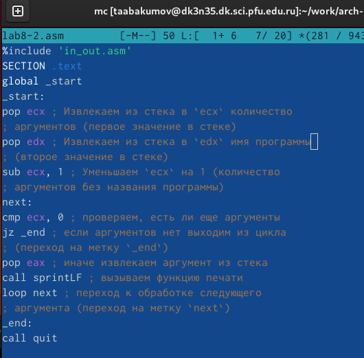{ #fig:009 width=70% }

Код программы из пункта 9:

%include 'in_out.asm'

SECTION .text

global _start

_start:

pop ecx 

pop edx

sub ecx, 1 

next:

cmp ecx, 0 

jz _end 

pop eax 

call sprintLF 

loop next 

_end:

call quit

10. Создадим исполняемый файл и запустим его, указав аргументы (рис. [-@fig:010]).

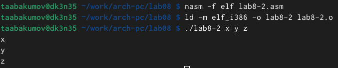{ #fig:010 width=70% }

11. Рассмотрим еще один пример программы которая выводит сумму чисел, которые передаются в программу как аргументы. Создадим файл lab8-3.asm в каталоге ~/work/arch-pc/lab08 (рис. [-@fig:011]).

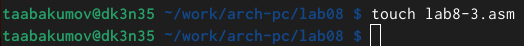{ #fig:011 width=70% }

12. Введём в него текст программы из листинга 8.3 (рис. [-@fig:012]).

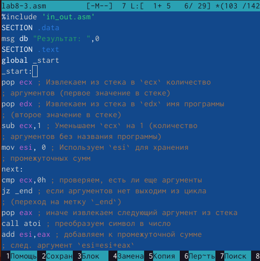{ #fig:012 width=70% }

Код программы из пункта 12:

%include 'in_out.asm'

SECTION .data

msg db "Результат: ",0

SECTION .text

global _start

_start:

pop ecx 

pop edx 

sub ecx,1 

mov esi, 0 

next:

cmp ecx,0h 

jz _end 

pop eax 

call atoi 

add esi,eax 

loop next 

_end:

mov eax, msg 

call sprint

mov eax, esi 

call iprintLF 

call quit 

13. Создадим исполняемый файл и запустим его, указав аргументы (рис. [-@fig:013]).

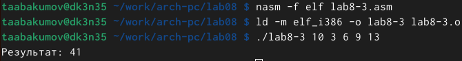{ #fig:013 width=70% }

14. Изменим текст программы из листинга 8.3 для вычисления произведения аргументов командной строки (рис. [-@fig:014]).

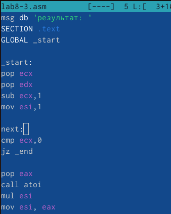{ #fig:014 width=70% }

Код программы из пункта 14:

%include "in_out.asm"

SECTION .data

msg db 'результат: '

SECTION .text

GLOBAL _start

_start:

pop ecx

pop edx

sub ecx,1

mov esi,1

next:

cmp ecx,0

jz _end

pop eax

call atoi

mul esi

mov esi, eax

loop next

_end:

mov eax, msg

call sprint

mov eax, esi

call iprintLF

call quit

15. Создадим исполняемый файл и запустим его, указав аргументы (рис. [-@fig:015]).

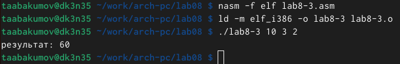{ #fig:015 width=70% }

## Заданий для самостоятельной работы

16. Для начала создадим файл lab8-4.asm в каталоге ~/work/arch-pc/lab08 (рис. [-@fig:016]).

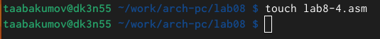{ #fig:016 width=70% }

17. Напишем программу, которая находит сумму значений функции f(x) для x = x1, x2, ..., xn, т.е. программа должна выводить значение f(x1) + f(x2) + ... + f(xn). Значения xi передаются как аргументы. Вид функции f(x) выбрать из таблицы 8.1 вариантов заданий в соответствии с вариантом, полученным при выполнении лабораторной работы № 7. Мой вариант - 9 (рис. [-@fig:017]).

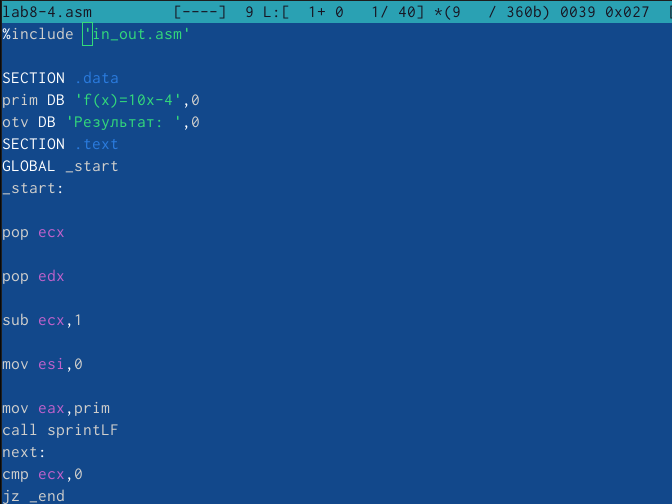{ #fig:017 width=70% }

Код программы из пункта 17:

%include 'in_out.asm'

SECTION .data

prim DB 'f(x)=10x-4',0

otv DB 'Результат: ',0

SECTION .text

GLOBAL _start

_start:

pop ecx

pop edx

sub ecx,1

mov esi,0

mov eax,prim

call sprintLF

next:

cmp ecx,0

jz _end

mov ebx,10

pop eax

call atoi

mul ebx

add eax,-4

add esi,eax

loop next

_end:

mov eax,otv

call sprint

mov eax,esi

call iprintLF

call quit

18. Создадим исполняемый файл и проверим его работу на нескольких наборах x = x1, x2, ..., x (рис. [-@fig:018]).

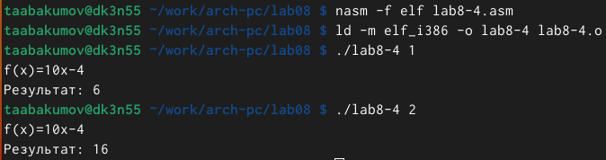{ #fig:018 width=70% }

# Выводы

Я приобрел навыки написания программы с использованием цикла.

