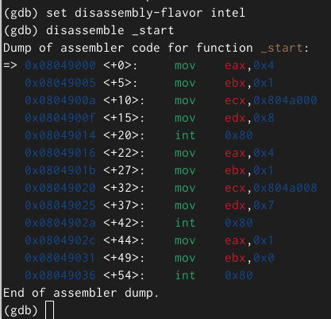
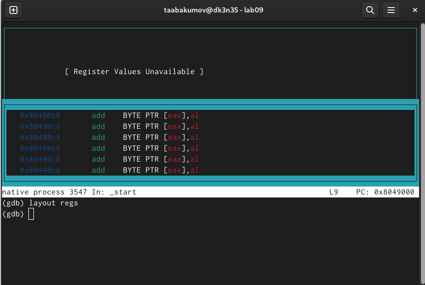
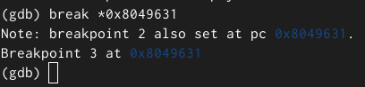

---
## Front matter
title: "Отчёт по лабораторной работе №9"
subtitle: "Дисциплина: Архитектура компьютера"
author: "Абакумов Тимофей Александрович"

## Generic otions
lang: ru-RU
toc-title: "Содержание"

## Bibliography
bibliography: bib/cite.bib
csl: pandoc/csl/gost-r-7-0-5-2008-numeric.csl

## Pdf output format
toc: true # Table of contents
toc-depth: 2
lof: true # List of figures
lot: true # List of tables
fontsize: 12pt
linestretch: 1.5
papersize: a4
documentclass: scrreprt
## I18n polyglossia
polyglossia-lang:
  name: russian
  options:
	- spelling=modern
	- babelshorthands=true
polyglossia-otherlangs:
  name: english
## I18n babel
babel-lang: russian
babel-otherlangs: english
## Fonts
mainfont: IBM Plex Serif
romanfont: IBM Plex Serif
sansfont: IBM Plex Sans
monofont: IBM Plex Mono
mathfont: STIX Two Math
mainfontoptions: Ligatures=Common,Ligatures=TeX,Scale=0.94
romanfontoptions: Ligatures=Common,Ligatures=TeX,Scale=0.94
sansfontoptions: Ligatures=Common,Ligatures=TeX,Scale=MatchLowercase,Scale=0.94
monofontoptions: Scale=MatchLowercase,Scale=0.94,FakeStretch=0.9
mathfontoptions:
## Biblatex
biblatex: true
biblio-style: "gost-numeric"
biblatexoptions:
  - parentracker=true
  - backend=biber
  - hyperref=auto
  - language=auto
  - autolang=other*
  - citestyle=gost-numeric
## Pandoc-crossref LaTeX customization
figureTitle: "Рис."
tableTitle: "Таблица"
listingTitle: "Листинг"
lofTitle: "Список иллюстраций"
lotTitle: "Список таблиц"
lolTitle: "Листинги"
## Misc options
indent: true
header-includes:
  - \usepackage{indentfirst}
  - \usepackage{float} # keep figures where there are in the text
  - \floatplacement{figure}{H} # keep figures where there are in the text
---

# Цель работы

Приобретение навыков написания программ с использованием подпрограмм. Знакомство
с методами отладки при помощи GDB и его основными возможностями.

# Задание

**Порядок выполнения лабораторной работы**

1. Реализация подпрограмм в NASM.
2. Отладка программам с помощью GDB.
3. Выполнение заданий для самостоятельной работы.

# Выполнение лабораторной работы

## Реализация подпрограмм в NASM

1. Создадим каталог для выполнения лабораторной работы № 9, перейдите в него и создадим файл lab09-1.asm (рис. [-@fig:001]).

{ #fig:001 width=70% }

2. В качестве примера рассмотрим программу вычисления арифметического выражения f(x) = 2x + 7 с помощью подпрограммы _calcul. В данном примере x вводится с клавиатуры, а само выражение вычисляется в подпрограмме. Введём текст программы из Листинга 9.1 (рис. [-@fig:002]).

{ #fig:002 width=70% }

Код программы из пункта 2:

%include 'in_out.asm'

SECTION .data

msg: DB 'Введите x: ',0

result: DB '2x+7=',0

SECTION .bss

x: RESB 80

res: RESB 80

SECTION .text

GLOBAL _start

_start:

mov eax, msg(рис. [-@fig:002]).

{ #fig:002 width=70% }заданий для самостоятельной работы.

call sprint

mov ecx, x

mov edx, 80

call sread

mov eax,x

call atoi

call _calcul ; Вызов подпрограммы _calcul

mov eax,result

call sprint

mov eax,[res]

call iprintLF

call quit

_calcul:

mov ebx,2

mul ebx

add eax,7

mov [res],eax

ret ; выход из подпрограммы

3. Создадим исполняемый файл и проверим его работу (рис. [-@fig:003]).

{ #fig:003 width=70% }

4. Изменим текст программы, добавив подпрограмму _subcalcul в подпрограмму _calcul, для вычисления выражения f(g(x)), где x вводится с клавиатуры, f(x) = 2x + 7, g(x) = 3x − 1. Т.е. x передается в подпрограмму _calcul из нее в подпрограмму _subcalcul, где вычисляется выражение g(x), результат возвращается в _calcul и вычисляется выражение f(g(x)). Результат возвращается в основную программу для вывода результата на экран. (рис. [-@fig:004]).

{ #fig:004 width=70% }

Код программы из пункта 4:

%include 'in_out.asm'

SECTION .data

msg: DB 'Введите x: ',0

prim1: DB 'f(x) = 2x+7',0

prim2: DB 'g(x) = 3x-1',0

result: DB 'f(g(x))= ',0

SECTION .bss

x: RESB 80заданий для самостоятельной работы.

res: RESB 80

SECTION .text

GLOBAL _start

_start:

mov eax,prim1

call sprintLF

mov eax,prim2

call sprintLF

mov eax,msg

call sprint

mov ecx,x

mov edx,80

call sread

mov eax,x

call atoi

call _calcul

mov eax,result

call sprint

mov eax,[res]

call iprintLF

call quit

_calcul:

call _subcalcul

mov ebx,2

mul ebx

add eax,7
заданий для самостоятельной работы.
mov [res],eax

ret

_subcalcul:

mov ebx,3

mul ebx

sub eax,1

ret

5. Создадим исполняемый файл и проверим его работу (рис. [-@fig:005]).

{ #fig:005 width=70% }

## Отладка программам с помощью GDB

6. Создадим файл lab09-2.asm (рис. [-@fig:006]).

{ #fig:006 width=70% }

7. Введём в файл lab09-2.asm текст из Лисзаданий для самостоятельной работы.тинга 9.2  (Программа печати сообщения Hello world!) (рис. [-@fig:007]).

{ #fig:007 width=70% }

Код программы из пункта 7:

SECTION .data

msg1: db "Hello, ",0x0

msg1Len: equ $ - msg1

msg2: db "world!",0xa

msg2Len: equ $ - msg2

SECTION .text

global _start

_start:

mov eax, 4

mov ebx, 1

mov ecx, msg1

mov edx, msg1Len

int 0x80

mov eax, 4

mov ebx, 1

mov ecx, msg2

mov edx, msg2Len

int 0x80

mov eax, 1

mov ebx, 0

int 0x80

8. Получим исполняемый файл. Для работы с GDB в исполняемый файл необходимо добавить отладочную информацию, для этого трансляцию программ необходимо проводить с ключом '-g'. После этого загрузим исполняемый файл в отладчик gdb и проверим работу программы, запустив ее в оболочке GDB с помощью команды run (рис. [-@fig:008]).

{ #fig:008 width=70% }

9. Для более подробного анализа программы установим брейкпоинт на метку _start, с которой начинается выполнение любой ассемблерной программы, и запустим её (рис. [-@fig:009]).

{ #fig:009 width=70% }

10. Посмотрите дисассимилированный код программы с помощью команды disassemble начиная с метки _start (рис. [-@fig:010]).

{ #fig:010 width=70% }

11. Переключимся на отображение команд с Intel’овским синтаксисом, введя команду set disassembly-flavor intel.Отличие заключается в командах, в диссамилированном отображении в командах используют % и $, а в Intel отображение эти символы не используются. На такое отображение удобнее смотреть (рис. [-@fig:011]).

{ #fig:011 width=70% }

12. Для удобства включим режим псевдографики (рис. [-@fig:012]).

{ #fig:012 width=70% }

13. На предыдущих шагах была установлена точка останова по имени метки (_start). Проверим это с помощью команды info breakpoints (рис. [-@fig:013]).

{ #fig:013 width=70% }

14. Установим еще одну точку останова по адресу инструкции. Определим адрес предпоследней инструкции (mov ebx,0x0) и установим точку останова (рис. [-@fig:014]).

{ #fig:014 width=70% }

15. Посмотрим информацию о всех установленных точках останова (рис. [-@fig:015]).

{ #fig:015 width=70% }

16. С помощью команды si посмотрим регистры и изменим их (рис. [-@fig:016]).

{ #fig:016 width=70% }

17. С помощью команды посмотрим значение переменной msg1 (рис. [-@fig:017]).

{ #fig:017 width=70% }

18. Следом посмотрим значение второй переменной msg2 (рис. [-@fig:018]).

{ #fig:018 width=70% }

19. С помощью команды set изменим значение переменной msg1 (рис. [-@fig:019]).

{ #fig:019 width=70% }

20. Также изменим переменную msg2 (рис. [-@fig:020]).

{ #fig:020 width=70% }

21. Выведем значения регистров ecx и eax (рис. [-@fig:021]).

{ #fig:021 width=70% }

22. Изменим значение регистра ebx. Команда выводит два разных значения так как в первый раз мы вносим значение 2, а во второй раз регистр равен двум, поэтому и значения разные (рис. [-@fig:022]).

{ #fig:022 width=70% }

23. После всего завершим работу с файлов (рис. [-@fig:023]).

{ #fig:023 width=70% }

24. Далее скопируем файл lab8-2.asm, созданный при выполнении лабораторной работы №8,
с программой выводящей на экран аргументы командной строки (Листинг 8.2) в файл с
именем lab09-3.asm. После чего создадим исполняемый файл (рис. [-@fig:024]).

{ #fig:024 width=70% }

25. Загрузим исполняемый файл в отладчик, указав аргументы. Установим точку останова перед первой инструкцией в программе (рис. [-@fig:025]).

{ #fig:025 width=70% }

26. Далее запустим программу (рис. [-@fig:026]).

{ #fig:026 width=70% }

27. Проверим адрес вершины стека и убедимся, что там хранится 4 элемента (рис. [-@fig:027]).

{ #fig:027 width=70% } 

28. Посмотрим все позиции стека. По первому адресу хранится адрес, в остальных адресах хранятся элементы. Элементы расположены с интервалом в 4 единицы, так как стек может хранить до 4 байт, и для того чтобы данные сохранялись нормально и без помех, компьютер использует новый стек для новой информации (рис. [-@fig:028]).

{ #fig:028 width=70% } 

## Задания для самостоятельной работы

Задание 1. Преобразуйте программу из лабораторной работы №8 (Задание №1 для самостоятельной работы), реализовав вычисление значения функции f(x) как подпрограмму.

29. Для начала создадим файл lab09-4.asm (рис. [-@fig:029]).

{ #fig:029 width=70% } 

30. Преобразуем программу из лабораторной работы №8 и реализуем вычисления как подпрограмму (рис. [-@fig:030]).

{ #fig:030 width=70% } 

31. Создадим исполняемый файл и проверим его работу (рис. [-@fig:031]).

{ #fig:031 width=70% }

Задание 2. В листинге 9.3 приведена программа вычисления выражения (3 + 2) * 4 + 5. При запуске данная программа дает неверный результат. Проверьте это. С помощью отладчика GDB, анализируя изменения значений регистров, определите ошибку и исправьте ее.

32. Для начала создадим файл lab09-5.asm (рис. [-@fig:032]).

{ #fig:032 width=70% } 

33. Перепишем программу из Листинга 9.3 в созданный файл (рис. [-@fig:033]).

{ #fig:033 width=70% }

Код программы из пункта 33:

%include 'in_out.asm'

SECTION .data

div: DB 'Результат: ',0

SECTION .text

GLOBAL _start

_start:

mov ebx,3

mov eax,2

add ebx,eax

mov ecx,4

mul ecx

add ebx,5

mov edi,ebx

mov eax,div

call sprint

mov eax,edi

call iprintLF

call quit

34. Создадим исполняемый файл и проверим его работу. Ошибка оказалась арифметическая, так как вместо 25, программа выводит 10 (рис. [-@fig:034]).

{ #fig:034 width=70% }

35. Из-за появления ошибки, запустим программу в отладчике (рис. [-@fig:035]).

{ #fig:035 width=70% }

36. Изменим регистры и запустим программу, программа вывела ответ 25, то есть все работает правильно (рис. [-@fig:036]).

{ #fig:036 width=70% }

(рис. [-@fig:037]).

{ #fig:037 width=70% }

# Выводы

Я приобрел навыки написания программ использованием подпрограмм. Познакомился с методами отладки при помощи GDB и его основными возможностями.

